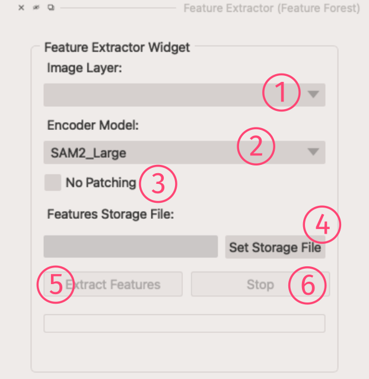

After selecting your image stack, you need to extract the *features*. Later, these image features will be used as inputs for training a Random Forest model, 
and predicting annotation masks.  

!!! info
    In deep learning, the output of an Encoder model is called <i>embeddings</i> or <i>features</i>.

You can bring up the *Feature Extractor widget* from the napari **Plugins** menu:  

{width="360"}

## Widget Tools Description
{width="360"}

1. **Image Layer**: To select your current image stack.
2. **Encoder Model**: Sets which model you want to use for feature extraction.  
    The **FF** plugins, by default, comes with `MobileSAM`, `SAM (huge)`, `μSAM_LM (base)`, `μSAM_EM_Organelles (base)`, `DINOv2`, `SAM2 (large)`, and `SAM2 (base)` models. It is also possible to introduce a new model by adding a new [*model adapter*](./model_adapter.md) class.
3. **No Patching**: If checked, it means no patching will happen during the feature extraction process. Otherwise, the image will be divided into patches before passing them through the encoder model. By using SAM2 encoders, you might check this box to save some computation power.  
4. **Features Storage File**: Where you want to save the features as an `HDF5` file.
5. **Extract Features** button: Will run the feature extraction process.
6. **Stop** button: To stop the extraction process!

## Model Selection
Our experiments tell us usually the `SAM2 (large)` model works the best. However, for less complicated images, using `MobileSAM` or `DINOv2` might also result in a good segmentation as they are lighter and faster.  

!!! note
    When you use a model for the first time, the model's weight will be downloaded from their repository.  So, you might hit a little delay at the first usage of model.  

Once you have your image features extracted, you can use the [**Segmentation**](./segmentation.md) widget to generate your image masks.
