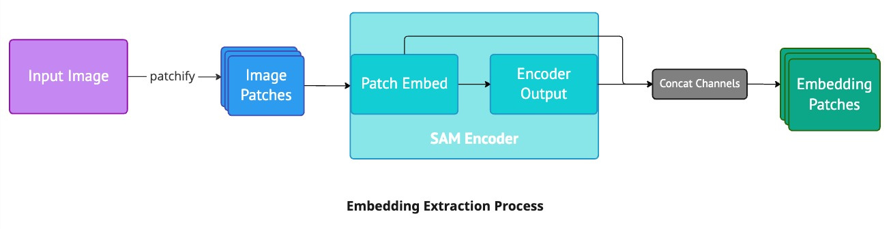
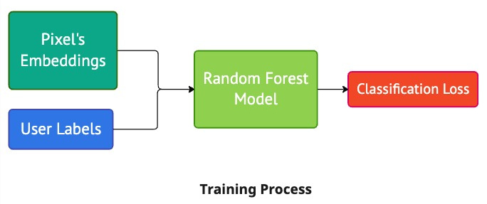
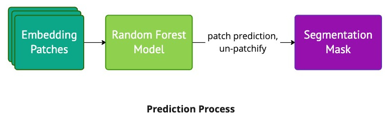

# Documentation
---

## How to use the plugin
This plugin provides four widgets; one for extracting the SAM embeddings and three for segmentation using different methods:
- [SAM Embedding Extractor](./widgets.md#sam-embedding-extractor-widget)
- [SAM-RF Widget](./widgets.md#sam-rf-widget)
    - [Notes](./widgets.md#notes)
- [SAM Prompt Segmentation Widget](./widgets.md#sam-prompt-segmentation-widget)
- [SAM Predictor Widget](./widgets.md#sam-predictor-widget)
  

## Overview of SAM-RF Segmentation

