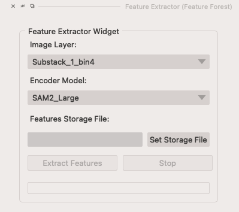
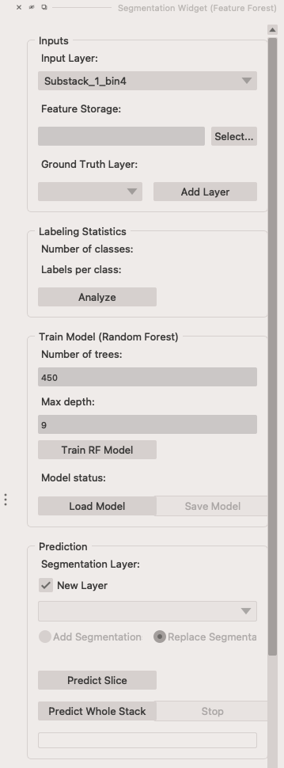
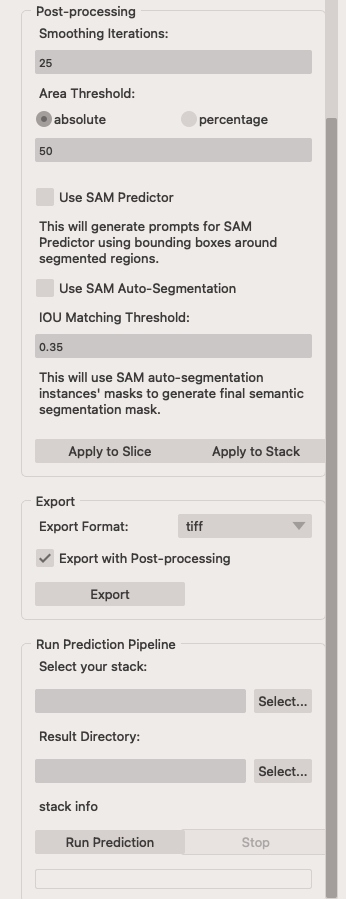

# Welcome to Feature Forest Documentation

*Feature Forest* (***FF***) is a [napari] plugin for creating image annotations with less manual work, utilizing image embeddings (*features*) of vision transformer models like [SAM2], and training a *Random Forest* model using a little scribble labels provided by the user.

### Overview
FF plugin includes two widgets: **Feature Extractor** and **Segmentation** widgets.

{width="300"}
/// caption
Feature Extractor Widget
///

{width="300" align=left}
{width="300" align=right}
/// caption
Segmentation Widget
///

[napari]: https://napari.org/
[SAM2]: https://ai.meta.com/sam2/
