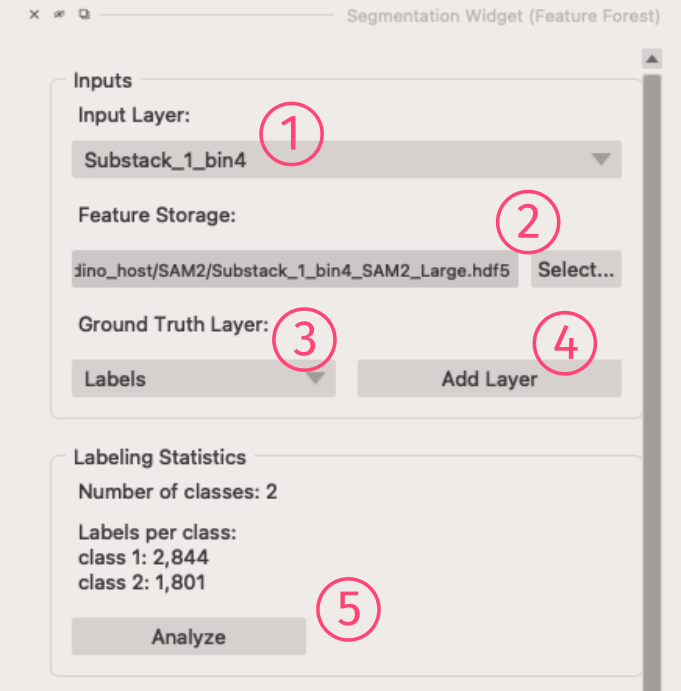
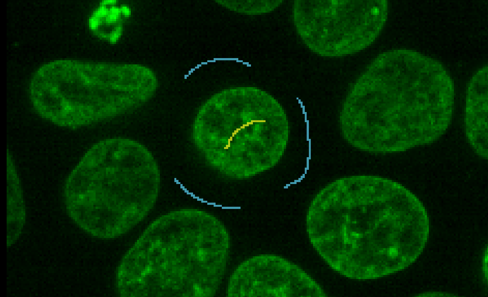
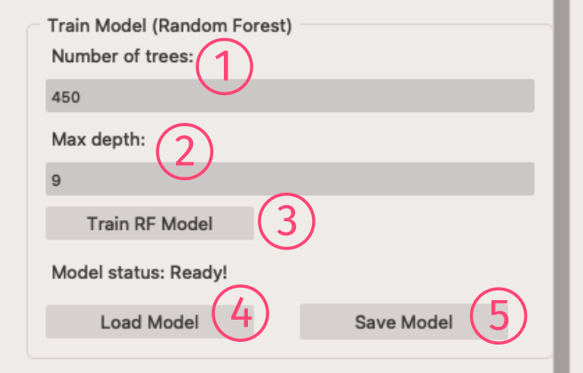
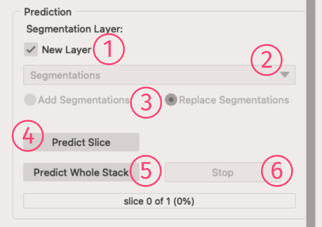
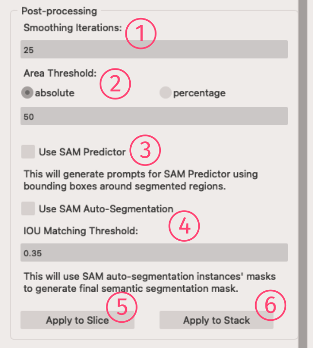
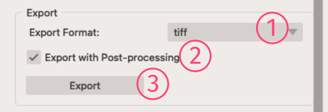
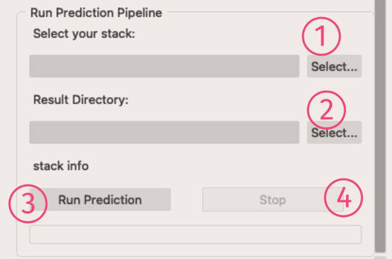

Hurray! Now you have your features extracted and ready for the main action! 😊  
The Segmentation widget is a long widget with several panels, but don't worry we'll go through all of them, from top to bottom!  

## Inputs and Labels' statistics
{width="360" align=right}
### Inputs
1. **Input Layer**: To set which napari layer is your input image layer
2. **Feature Storage**: Select your previously extracted features `HDF5` file here.  
    ***Note***: You need to select the storage file for the selected input image, obviously!
3. **Ground Truth Layer**: To select your *Labels* layer
4. **Add Layer** button: To add a new GT layer to napari layers

!!! note
    For annotations, users are expected to label pixels in the `Labels` layer and provide annotations as scribbles for multiple classes.
    This can be done by selecting the `paint brush` tool and choosing a specific `label` id for each class.
    An example screenshot has been provided to show how to provide annotations for, eg. the background class and foreground (nuclei) class.

{width="360", align=right}

### Labeling Statistics
5. **Analyze** button: To get info about number of classes and labels you've added so far.

!!! note
    - You can have as many *Labels* layer as you want. But **only the selected** one will be used for training the RF model.  
    - You can also drag & drop your previously saved labels into the napari and select that layer.

## Training the RF Model
{width="360" align=right}
<h3>Train Model (Random Forest)</h3>
1. **Number of Trees**: To set number of trees (estimators) in the forest
2. **Max depth**: The maximum depth of a tree
3. **Train** button: To extract the training data and train the **RF** model
4. **Load Model** button: Using this, you can load a previously trained and saved model.
5. **Save Model** button: To save the current RF model

!!! tip
    - Setting a high value for the `Max depth` would overfit your **RF** model over the training data. So, it won't perform well on test images.
    But if you're doing the segmentation over the entire stack (or a single image), you may try higher values.

## Prediction
{width="360" align=right}
<!-- <h3>Prediction</h3> -->
###### Segmentation Layer
1. **New Layer**: If checked, the segmentation result will show up on a new layer in napari
2. **Layer Dropdown**: You can select which layer should be used as the layer for the segmentation result
3. **Add/Replace Segmentation** option: Based on your choice, this will add new segmentation to the previous result, or completely replace the result (Default).
###### Buttons
4. **Predict Slice** button: To generate the segmentation mask for the *current* slice
5. **Predict Whole Stack** button: to start the prediction process for the whole loaded stack
6. **Stop** button: Just for your safety!😉 this will stop the prediction process.

## Post-processing
{width="360" align=right}
<!-- <h3>Post-processing</h3> -->
1. **Smoothing Iterations**: Sets how many times the min-curvature smoothing algorithm should be run.
2. **Area Threshold**: You can set a threshold to remove very small regions with area below this threshold. It can be an absolute pixel based area, or a relative percentage value (100% will be the largest region in the mask).
3. **Use SAM Predictor**: To use SAM as the mask predictor. By checking this option, a bounding box around each **RF** generated mask will be feeded as a prompt to SAM, and SAM will predict the final mask.
4. **Use SAM Auto-Segmentation**: By choosing this option, first, SAM auto-segmentation process predicts all possible mask components in the image, then those components with high IOU over the **RF** predicted components will be selected as the final mask.
    - **IOU Matching Threshold**: The threshold to match SAM auto-segmentation masks with the **RF** predicted ones. SAM generated components with IOU below this threshold will be ignored.
5. **Apply to Slice** button: This will run the post-processing and apply it to the mask.
6. **Apply to Stack** button: To apply the post-processing to the whole loaded stack, please push this button!

!!! info
    **RF** prediction is pixel based, so the mask will have holes, fuzzy edges and it's not smooth. To make the predicted mask smooth, we are using the *min-curvature smoothing* algorhitm which is a edge-preserving iterative algorithm. It means, this algorithm will not change the overall shape of the mask components while smoothing them, and you have the power to run it enough times to get your desired results.

!!! tip
    Using SAM for the post-processing usually generate a decent mask. If your image has small number of almost well-separated objects, then we recommend using the **SAM Auto-Segmentation** option. Otherwise, use the **SAM Predictor**. It will be faster as well.

## Export
{width="360" align=right}
With this panel, you can export the predicted mask into provided formats.  

1. **Export Format**: To select the export file format. Currently *TIFF*, *NRRD*, *NUMPY* are supported.
2. **Export with Post-processing**: If checked you'll export the post-processed mask.
3. **Export** button: Open up a save dialog to get where to save the file.

## Run Prediction Pipeline
{width="360" align=right}
When you are happy with the trained **RF** model, you can use this panel to run the prediction over the whole large stack that you may have.  

1. **Select your stack**: Set your large stack here.
2. **Result Directory**: To se where to save the prediction results
3. **Run Prediction** button: To run the process and go for a drink!
4. **Stop** button: In case of any regrets or forgetfulness, use this!

!!! info
    Results will be saved image-by-image as *TIFF* files. Also, all the set post-processing will be applied and saved in separate folders.