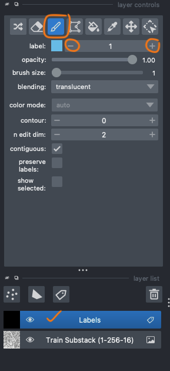
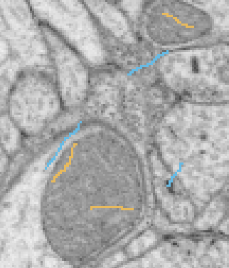

Here, we provide a simple tutorial on how to use FeatureForest (**FF**). We assume you have already extracted and saved your train image/stack features using the [Feature Extractor widget](feature_extractor.md).

## Let's Begin!
Load your image and open the Segmentation widget. The first step is to choose your image features **HDF5** file. Click on the "**Select...**" button and select your **HDF5** file.

!!! note
    If you loaded more than one image/stack, you need to select your target image from the "**Input Layer**" dropdown.

{width="228", align=right}

The next step is to add a label layer. Use the "**Add Layer**" button. You can have more than one label layer. However, only the selected one is the effective label layer for training the RF model.  
Now, it's time to add some scribble labels. Select the label layer and then use the brush tool from the layer's top toolbar. Always use the first class *"1"* for labeling your *background* (areas you don't want to create a mask for).  
You can change the class and add labels for the next class, which are objects of interest (areas that you want to create masks for) by increasing the label number.  
If you make a mistake, you can remove the labels by selecting the eraser button and removing the wrong labels.

!!! note
    - Always make sure you select the label layer before using the brush tool.
    - Class *1* must always be assigned to the background. We use this constraint to make sure the final mask won't include the background and to make it transparent on the napari viewer.

After adding some labels, use the "**Train RF Model**" button to train the RF model. You can set the number of trees and the tree's max depth. But be careful not to set a high value for the max depth parameter. It will result in an *over-fitted* RF model, and it wouldn't perform well over images not presented in your training stack.  
When the training is done, use the "**Predict Slice**" button to make your first segmentation mask. We know the first one is usually not very good 🙁, but don't get disappointed! Good results will come with consistency, so do some more iterations 😊.

{width="300", align=right}
!!! tip
    Add some labels for background and other classes near the boundaries of targeted objects. This way you provide the most distinctive information for the model.

**Don't add too many labels!**

Training a model is an iterative process, so add as few labels as possible at each iteration. Then, train the RF model, make a prediction, and repeat the process by adding a bit more labels over the areas where the model made mistakes.  
For labeling, you can use any slices in the training stack. Therefore, it's better to make predictions over the whole stack and add more labels on the slices in which the model performs poorly.

!!! tip
    The default brush size is set to *one*. We recommended using very *thin* labels to avoid annotating unnecessary pixels. Neighboring pixels usually have similar features, which won't provide distinctive information for the training RF model.

## What about the post-processing?
Post-processing is kind of our winning card! Since we are using a RF model for pixel classification, the produced masks usually have holes and fuzzy edges, and post-processing is there to fix that!

### Simple post-processing:
The postprocessing will use a simple morphology and mean-curvature smoothing to fill holes and smooth the edges. You can set the number of smoothing iterations.  
The next step is to eliminate small noisy areas that should not be included in the mask (usually from the background class). You can set the area threshold for that, and all small regions with an area below the threshold will be excluded from the mask.

### Post-processing using SAM2
If you select the "**Use SAM Predictor**" option, bounding boxes around the regions of the RF-predicted mask will be used as prompts to SAM2. Then you will get a nice smooth mask as if you provided those prompts to SAM2. Smart, don't you agree?! 😁  
The "**Use SAM Auto-Segmentation**" option will use SAM2 auto-segmentation prediction and then select regions that intersect with the RF mask above the set threshold. We recommend using this option only if you have *not too many objects* in the image. Otherwise, it will be slow and take some time to make the final mask.

!!! info
    - Use the "**Export**" button to save the created mask. This way the labels will be *0* for the background and onwards for other classes. If you save the mask using the napari file menu, labels will be started from *1* and on...

    - Every time you make a prediction, the result will appear on a new layer unless you uncheck the "**New Layer**" checkbox.

Thanks for using **FF**, and have a happy experience! 🙌
