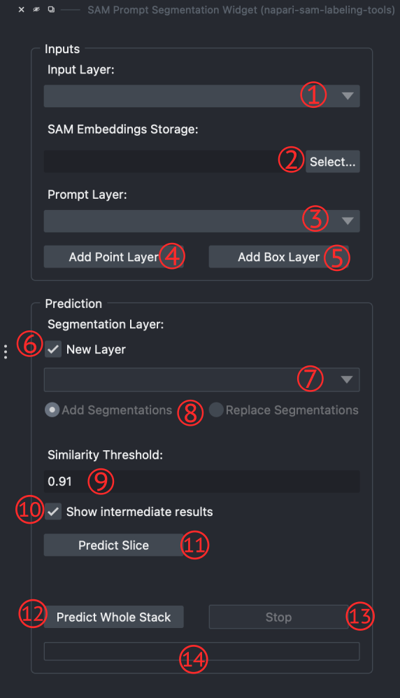

# Plugin Widgets

This plugin provides four widgets: one for extracting the SAM embeddings and three for segmentation using different methods.  

## SAM Embeddings Extractor Widgets
SAM embeddings will be used for running prediction in two other widgets: **SAM-RF Widget**, and **SAM Prompt Segmentation Widget**.  
Therefore, we provided a widget to extract embeddings of the loaded input stack and save them on disk in the *HDF5* format.  

1. **Input layer combo box:** to select input image (stack)
2. **Set storage:** to select where the storage should be saved.
3. **Extract Embeddings button:** to start extracting SAM embeddings
4. **Stop button:** to stop the extraction process.
5. **Process progress bar:** showing extraction progress.  
  

## SAM-RF Widget
This widget is designed to perform segmentation while using the SAM embedding features instead of the image features, along with the user-provided sparse labels using a *Random Forest* model.  
The number of required labels for having almost nice-looking segmentations compared to the number of pixels is super low.  
The provided *postprocessing* methods can create even more accurate and cleaner annotations.

1. **Input layer combo box:** to select input image (stack).
2. **Embedding Storage Select button:** to select the embedding storage file.
3. **Ground Truth Layer:** to select or add a new ground truth layer (napari Labels layer).
4. **Analyze button:** to check number of user-provided labels for each class.
5. **Random Forest Number of trees:** to set number of trees for the RF model.
6. **Random Forest Max depth:** to set maximum depth for each tree in the RF model. pass 0 to set it as *unlimited*.
7. **TrainRF Model button:** to start training of the RF model.
8. **Load Model button:** to load an already trained RF model.
9. **Save Model button:** to save the trained RF model.
 

10. **New Layer checkbox:** if checked, the segmentations result will be added into a new layer.
11. **Segmentation layer combo box:** if *New Layer* is unchecked, then user must select the segmentations layer.
12. **Segmentation layer options:**
    - **Add Segmentations:** the result will be added to the selected layer. In other words, pixels which segmented as non-background will be added to the selected layer.
    - **Replace Segmentations:** the selected layer content will be replaced with the result.
13. **Postprocess Segmentation checkbox:** if checked, the segmentations result will be postprocessed.
14. **Area Threshold inputbox:** if postprocess checked, then the area threshold will be used to eliminate small segmented objects with area below the set threshold. The higher the area threshold, the more segmented objects will be eliminated.
15. **Use SAM Predictor checkbox:** to use *SAM predictor* model to predict final segmentations using the RF model prediction as input prompts (prompts will be bounding boxes around RF segmented objects).
16. **Predict Slice button:** to run the prediction for the current image slice.
17. **Predict Whole Stack button:** to run prediction for the whole loaded stack.
18. **Stop button:** to stop the prediction process (whole stack prediction migth take a long time).
19. **Prediction Progressbar:** to show the prediction progress.  
  

## SAM Prompt Segmentation Widget
In this widget, you can make segmentation by only putting a few prompts into the prompt layer. The prompt layer's type can be point or box.  
After setting the prompts and hitting the *Predict* button, a mask will be generated by the SAM predictor. Then by taking the average of all pixels in the predicted mask, using SAM embedding space (in the storage file), a feature vector will be calculated. The similarity matrix is computed by taking the cosine similarity between each pixel's feature vector and the obtained average vector.  
After thresholding the similarity matrix, new prompts will be generated inside the remaining areas (of the similarity matrix). Finally, the generated prompt passes through the SAM predictor, and the final segmentation mask will be generated.

1. **Input layer combo box:** to select input image (stack).
2. **Embedding Storage Select button:** to select the embedding storage file.
3. **Prompt layer combo box:** to select the input prompt layer.
4. **Add Point Layer button:** to add a new point prompt layer.
5. **Add Box Layer button:** to add a new box prompt layer (basically it's a napari shapes layer).
6. **New Layer checkbox:** if checked, the segmentations result will be added into a new layer.
7. **Segmentation layer combo box:** if *New Layer* is unchecked, then user must select the segmentations layer.
8. **Segmentation layer options:**
    - **Add Segmentations:** the result will be added to the selected layer. In other words, pixels which segmented as non-background will be added to the selected layer.
    - **Replace Segmentations:** the selected layer content will be replaced with the result.
9. **Similarity Threshold inputbox:** pixels with cosine similarity above this threshold will be added to the segmentation mask for the next step.
10. **Show Intermediate Results checkbox:** if checked, the intermediate calculations including user prompt mask, similarity matrix, selected areas, and generated prompts will be shown as layers.
11. **Predict Slice button:** to run the prediction for the current image slice.
12. **Predict Whole Stack button:** to run prediction for the whole loaded stack.
13. **Stop button:** to stop the prediction process (whole stack prediction migth take a long time).
14. **Prediction Progressbar:** to show the prediction progress.  
  

## SAM Predictor Widget
This widget simply uses the user prompts and gives them to the SAM predictor model to get the segmentations. Prompts can be in the form of points (only positive) or boxes.  
This widget works nicely for objects having more clear boundaries. It also can be used as a complementary method over the **SAM-RF Widget**.

1. **Input layer combo box:** to select input image (stack).
2. **Prompt layer combo box:** to select the input prompt layer.
3. **Add Point Layer button:** to add a new point prompt layer.
4. **Add Box Layer button:** to add a new box prompt layer (basically it's a napari shapes layer).
5. **New Layer checkbox:** if checked, the segmentations result will be added into a new layer.
6. **Segmentation layer combo box:** if *New Layer* is unchecked, then user must select the segmentations layer.
7. **Segmentation layer options:**
    - **Add Segmentations:** the result will be added to the selected layer. In other words, pixels which segmented as non-background will be added to the selected layer.
    - **Replace Segmentations:** the selected layer content will be replaced with the result.
8. **Predict Prompts button:** to do the prediction using SAM's predictor.  
  

